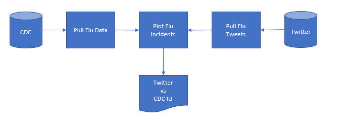
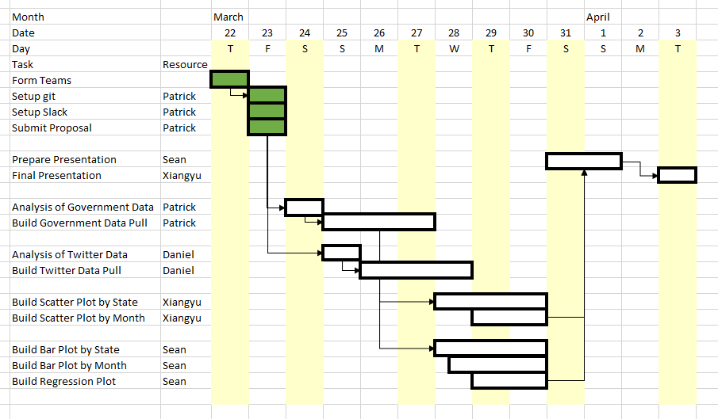

<h1>Analyticus</h1>

Analyticus is a project team of the USC Viterbi Data Analytics Bootcamp. 
The members are:

<ul>
<li>Daniel Ohriner</li>
<li>Patrick Humphries</li>
<li>Yachen Yu</li>
<li>Xiangyu Zhang</li>
</ul>
<h2>Projects</h2>
<ul>
<li>Project 1:  HHC Vaccination Correlation to CDC Reporting Influenza-Like-Illnesses (ILI)

<b>Is there a corelation between vaccination rates and rates of influenza?</b>

<ul>
<li><b>Problem:</b>  During the recent flu season, the effectiveness of the vaccine was questioned?</li>
<li><b>Hypothesis:</b>  If the vaccine is effective, then states with high vaccination rates will have low influenza rates.</li>
<li><b>Test:</b>  Compare vaccination rates from Health and Human Services (HHS) and compare them to the rates of influenza from the Center of Disease Control (CDC).</li>
</ul>
<h3>Abstract</h3>

There have been recent concerns regarding flu vaccinations, flu outbreaks, and supplies of flu shots.

The purpose of this project is to determine if the flu vaccinations were effective against the influenza of this year, thus mitigating recent concerns.

The Center Disease Control (CDC) publishes "PERCENTAGE OF VISITS FOR INFLUENZA-LIKE-ILLNESS REPORTED BY SENTINEL PROVIDERS" 
from their "FluView" website (https://gis.cdc.gov/grasp/fluview/fluportaldashboard.html).

The Health and Human Resources (HHS) publishes "trends: vaccination rates for an entire flu year" from their "HHS Flu Vaccination API" website (https://fluvaccineapi.hhs.gov).

If the vaccine were effective, states with low vaccination rates should have high influenza rates.  Conversely, states with high vaccination rates should have low influenza rates.  

The HHS source will be plotted against the CDC source.  

<h3>Structure</h3>

<h3>Schedule</h3>

